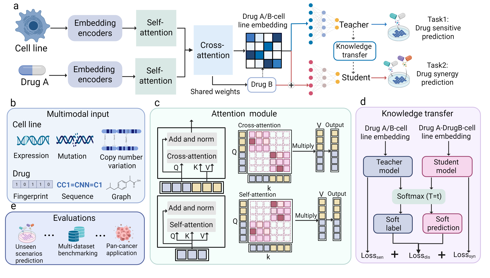

# UniSyn:A Multi-Modal Framework with Knowledge Transfer for Drug Synergy Prediction<br/>
This repository contains the source code for the paper

<br/>
Please see our manuscript for more details.<br/>
### Installation
1. Clone the repository.

   ```python
   git clone https://github.com/codejiajia/UniSyn.git
   ```
2. Create a virtual environment by conda.

   ```python
   conda create -n UniSyn_env python=3.9.20
   conda activate UniSyn_env
3. Download PyTorch>=2.4.1, which is compatible with your CUDA version and other Python packages.

   ```python
   conda install pytorch==2.4.1 torchvision==0.19.1 torchaudio==2.4.1 pytorch-cuda=12.1 -c pytorch -c nvidia -c pytorch # for CUDA 12.1
   pip install -r requirements.txt
   ```
### Data and model checkpoints
The following data and model checkpoints are available at [zenodo](https://zenodo.org/records/16352141).

- `data/drugcomb`: The curated datasets for monotherapy response and drug synergy prediction are derived from DrugComb `data_to_split.csv`.Each drug is associated with three raw data modalities: fingerprints `Drug_use.csv`, SMILES sequences `drug_sequence_em.csv`, and molecular graphs `drug_feature_graph.npy`. The file `Drug_map.npy` provides the mapping between drug indices and names. Each cell line includes gene expression `Cell_use_zscore.csv`, somatic mutation `mutation.csv`, and copy number variation `nv_zscore.csv` data.
- `data/O'Neil`:The O'Neil dataset follows the same structure as DrugComb, containing matched files for monotherapy response, drug synergy prediction, and multi-modal features of both drugs and cell lines.
- `data/NCI-ALMANAC`:The NCI-ALMANAC dataset follows the same structure as DrugComb, containing matched files for monotherapy response, drug synergy prediction, and multi-modal features of both drugs and cell lines.
- `data/CCLE`:Cell line annotations data, including Model ID, CellLineName, Oncotree Lineage, and other metadata.
- `data/CTRPv2`:Drugs for prospective synergy prediction, including drug name, status, SMILES, and other metadata.
- `data/Unseen`: Contains training, validation, and test sets for the CellOut, DrugPairOut, and BothOut scenarios.
- `data/PaccMann`:Contains the list of genes associated with drug sensitivity.
- `data/Preprocessing`: Contains all data required for generating standardized datasets and corresponding drug and cell line features derived from preprocessing the DrugComb dataset.
- `checkpoints/Pretained`: Pretrained model checkpoints for monotherapy response and drug synergy prediction.

### Usage
#### 1. Preprocessing
To prepare the input data for model training, run the following Jupyter notebooks and scripts in order. Each file performs a specific preprocessing step on the `DrugComb dataset` and its associated drug/cell line features:
- `1.dataset_preprocessing.ipynb`：Clean and format the raw DrugComb dataset for feature generation and training.
- `2.drug_fingerprint.ipynb`：Generate drug molecular fingerprints features.
- `3.cellfeature_preprocessing.ipynb`：Extract and normalize cell line omics features including gene expression, mutation, and CNV.
- `4.String_to_Int.ipynb`:Convert categorical identifiers (drug and cell line names) into integer indices.
- `5.drug_feature_graph.ipynb`:Transforms drug SMILES sequences into graph structured data for graph neural network modeling.
- `6.drug_seq.py`: Generate drug sequence representations.
#### 2. Pre-training
  ```python
#Train monotherapy response and drug synergy prediction models.
   python main.py --split_flag = 1 train_flag = 1
   ```
#### 3. Monotherapy and Synergy Prediction
  ```python
   python main.py --test_flag = 1
   ```
#### 4. Unseen Scenario Prediction
To re-generate datasets for different scenarios:
```python
   python main.py --split_flag=1 split_mode = [1,2,3,4] #1:normal,2:drugout,3:cellout, 4:bothout
   ```
To load pre-generated training, validation, and test sets from the data/Unseen/ directory:
```python
  python main.py --split_flag=0
   ```
